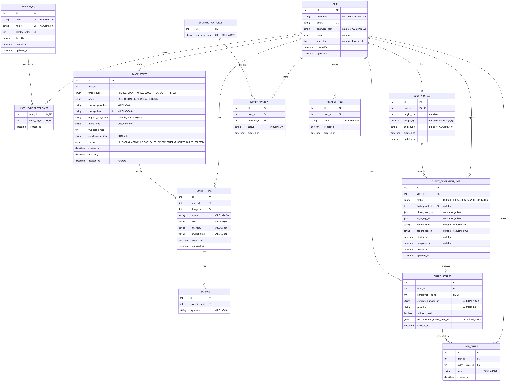
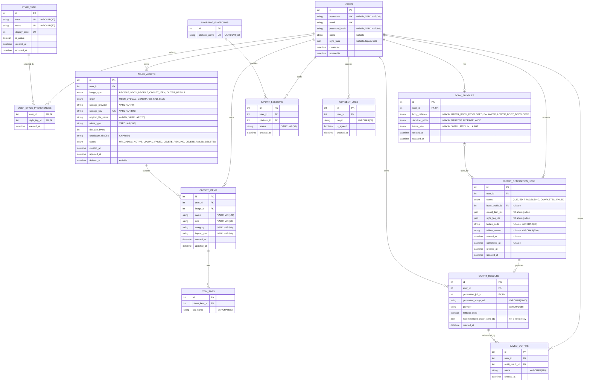

# Fitty Backend ERD

> 이 문서는 `prisma/schema.prisma`와 `prisma/migrations/*/migration.sql`을 기준으로 작성한 **현재 구현 스키마 ERD**입니다. 기획 단계의 목표 모델이 아니라, 현재 공유 브랜치에 정의된 MySQL 테이블·관계·제약조건을 나타냅니다.

## 핵심 관계와 제약조건

- `users`는 이미지, 옷장 아이템, 가져오기 세션, 동의 기록, 코디 생성 작업·결과·저장본을 소유합니다.
- `body_profiles.user_id`는 유일하므로 사용자당 신체 프로필은 최대 1개입니다.
- `user_style_preferences`는 `(user_id, style_tag_id)` 복합 기본키를 사용하는 사용자-스타일 태그 연결 테이블입니다.
- `outfit_results.generation_job_id`는 유일하므로 코디 생성 작업당 결과는 최대 1개입니다.
- `saved_outfits`는 `(user_id, outfit_result_id)`가 유일하므로 같은 사용자가 같은 결과를 중복 저장할 수 없습니다.
- `item_tags`는 `(closet_item_id, tag_name)`가 유일하므로 같은 옷장 아이템에 동일한 태그를 중복 등록할 수 없습니다.
- `outfit_generation_jobs.closet_item_ids`, `outfit_generation_jobs.style_tag_ids`, `outfit_results.recommended_closet_item_ids`는 JSON 값이며 관련 테이블을 참조하는 데이터베이스 외래키가 아닙니다.
- `outfit_results.generated_image_url`도 현재 `image_assets`와 외래키로 연결되어 있지 않습니다.
- `users.style_tags`는 기존 JSON 필드로 남아 있으며, 정규화된 현재 선호 관계는 `user_style_preferences`와 `style_tags`에 함께 정의되어 있습니다.

## 삭제 정책

- `user_style_preferences`의 사용자 삭제는 `CASCADE`, 스타일 태그 삭제는 `RESTRICT`입니다.
- `item_tags`는 연결된 옷장 아이템 삭제 시 `CASCADE`입니다.
- 코디 생성 작업의 신체 프로필 참조는 프로필 삭제 시 `SET NULL`입니다.
- 그 밖의 현재 외래키 관계는 모두 `RESTRICT`입니다.
